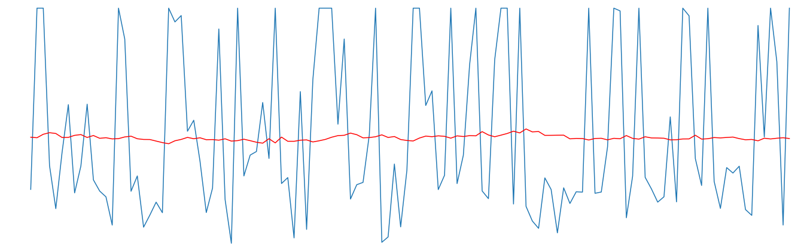
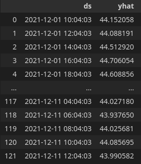
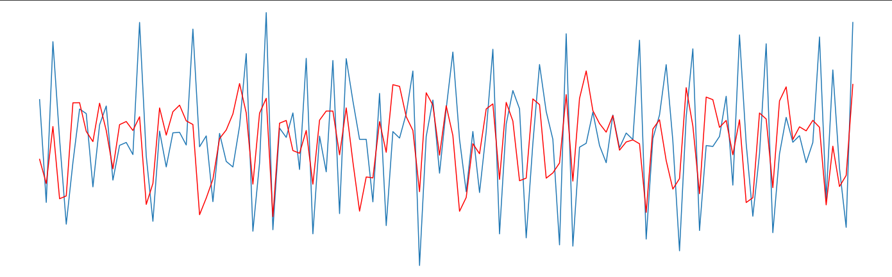

# Air Quality Prediction
## About The Project

This project compares two types of time series forecast models. These models predict the amount of PM10 in the air. PM10 are particles that are less than or equal to 10 micrometers ([For more info click this link](https://www.epa.gov/pm-pollution/particulate-matter-pm-basics)). This is important to predict because these particles can be inhaled and if there are a lot of these particles in the air, it can be damaging to your health. 

This project compares a Prophet model and an Autoregression model. Prophet is a procedure for predicting time series data developed by Facebook’s Core Data Science team ([Prophet’s Website](https://facebook.github.io/prophet/)). Prophet is available as a package for both python and R. 


## Installation

1. Clone the repo
  ```sh
  git clone https://github.com/IanRayburn/Air_Quality_Prediction
  ```
2. Setup your env
  ```sh
  conda env create -f requirements.yml
  ```


## Results
 | Method                          | RMSE | MAE |
|---------------------------------|:------:|:-----:|
| **Prophet** | 10.034316 | 8.797047 |
| **Auto Regression** | 11.010766 | 9.313077 |

From these results, the obvious choice for the data is the Prophet model. However, on closer inspection of the predicted values from each model overlayed on the real values (Fig. 1, Fig. 2), the AR model outperforms the Prophet model. 



*Fig. 1* shown above shows the predicted values from the Prophet model on top of the real values. From the image, you can see how the model predicts mostly around the average value in the dataset as shown in *Fig. 2*. 





*Fig. 3* above shows the predicted values from the AR model on top of the real values. The image shows that the AR model's prediction is more lined up with the dataset. The predicts show more of a variety of predicted values.

When predicting air quality it is very important to predict the extreme values to make a judgment on whether the air is safe to breathe. The Prophet model predicts mostly around the mid-40s PM10. This puts the air quality on the high end of the 0-50 PM10 range. According to [airnow.gov](https://www.airnow.gov/aqi/aqi-basics/) in this range, the air quality is good for most people and does not pose any or little risk. The dataset's values can reach 60 PM10. [airnow.gov](https://www.airnow.gov/aqi/aqi-basics/) shows values from 51 to 100 PM10 can be harmful to those that are very sensitive to air pollution. In a situation where the PM10 crossed 50 and the Prophet model predicted the average, a more sensitive person may be misled into believing that the air quality is safe for them. The AR model would predict a value that would better represent the danger level.  

## Usage

### **Loading Prophet Model**

To implement the Prophet model to use in another project, you need to load the model into your project. 

To do this first you need to make sure you have make sure you have the `Prophet_model/Prophet_model.pkl` file. If you followed the installation instructions you should have this file in the `Prophet_model` folder. Once you have this file we can load it into your project.

Open up your python file where you want the model then run this:

```python
import pickle

with open("path/to/Prophet_model.pkl", "rb") as f:
    model = pickle.load(f)
```

The prophet model will be stored in the variable `model`. Then, you can use it like any other prophet model.

### **Loading AR Model**

Loading the AR model into a different project follows a similar process to the prophet model. Make sure you have the file `AR_model/ar_model.pkl`. This can be found in the AR_model folder. Then, you need to run this code in your python file you want the model in:

```python
from statsmodels.tsa.ar_model import AutoRegResults
import numpy

model = AutoRegResults.load('ar_model.pkl')
data = numpy.load('ar_data.npy')
last_ob = numpy.load('ar_obs.npy')
```

To make a prediction with this model you need to run:

```python
# This Predicts the next observation
predictions = model.predict(start=len(data), end=len(data))
yhat = predictions[0] + last_ob[0] # 0 is the next observation, 1 is the 2nd etc...
print(f"Prediction: {yhat}")
```

This should give you the value the model predicted. 

### **Data Format**

Both of these models need the data to be formatted in two specific ways.

**Prophet data format**

The data frame for a prophet model needs two columns, one for the Timestamp and one for the data you are trying to predict. The data for a prophet model needs to have specific column name. The Timestamp column needs to be called ds and the column you are trying to predict needs to be called y. The y column has to be numeric. The Timestamp column needs to be in either "YYYY-MM-DD" or "YYYY-MM-DD HH:MM:SS". When using `pandas.read_csv()`, you need to set the column indexing to 1. This is default for the function, so you do not have to pass a parameter to the function.

_For more info, please refer to the [Prophet Documentation](https://facebook.github.io/prophet/docs/quick_start.html#python-api)_

**AR data format**

This model needs two columns, one for the Timestamp and one for the value you are trying to predict. The AR model does not require specific column names. In the notebook I renamed the column names to the prophet requirements to keep it easier to track while going in between the two models. When using `pandas.read_csv()`, you need to set a couple of parameters.

This is what the `pandas.read_csv()` should look like:

```python
pandas.read_csv("path/to/data", index_col=0, parse_dates=True, squeeze=True)
```


## Authors

Your Name - [IanRayburn](https://github.com/IanRayburn) - ianrayburn5@gmail.com

Project Link: [https://github.com/IanRayburn/Air_Quality_Prediction](https://github.com/IanRayburn/Air_Quality_Prediction)


## Acknowledgements

* [README Template](https://github.com/catiaspsilva/README-template/blob/main/README.md#about-the-project)
* [AR model tutorial](https://machinelearningmastery.com/make-predictions-time-series-forecasting-python/)
* [Prophet Offical Website](https://facebook.github.io/prophet/)